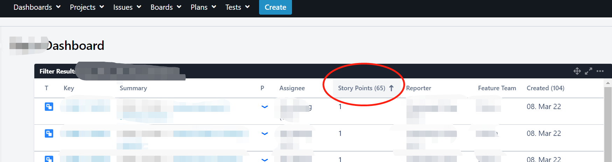
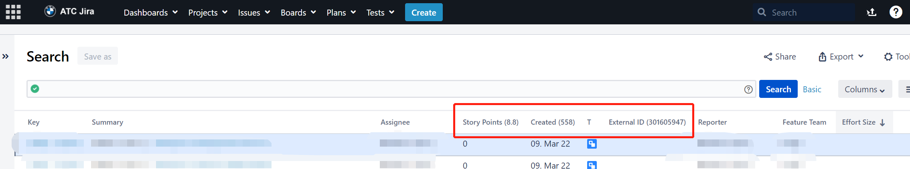

# JiraTableCounter

自动计算 `Jira` 二维表格中各数字列的总和，并将结果附加显示到表头。

## 功能

- 扫描 Jira 表格中的数值单元格。
- 按列汇总数值。
- 将汇总结果追加到对应列标题后方。

## 适用场景

- 需要快速统计 Jira 列表中某些数字列总和时。
- 适用于带表格视图的 Jira 页面。

## 文件

- 脚本文件：`JiraTableCounter.js`

## 预览

## 安装方式

1. 安装浏览器扩展 [Tampermonkey](https://www.tampermonkey.net/)。
2. 新建一个用户脚本。
3. 复制 `JiraTableCounter.js` 的内容并保存。
4. 打开 Jira 相关页面验证是否生效。

## 说明

- 当前脚本依赖 `jQuery` 与 `waitForKeyElements`。
- 若 Jira 页面结构变化，选择器可能需要同步调整。
